# Running the impakkt Proof of Authority Blockchain

The following explains how to start and run the impakkt Ethereum Blockchain.

You can use the package-list.txt file included in the repository to create a new environment and install all the necessary packages using the following command in Terminal:

    conda create -n myenv --file package-list.txt

---

## **NETWORK CONFIGURATION**

*blockchain network*

    network name: impakkt
    chain id = 39508

*node 1*

    pass: impakkt33

    public address: 0xa9CcfAa94C61ed2ffFe17b529fDB25e229A364F7

    Path of the secret key file: node1/keystore/UTC--2021-02-02T05-09-39.612731000Z--a9ccfaa94c61ed2fffe17b529fdb25e229a364f7

    enode://07d222c7f70139e47bf9a8010e1967e06075f440f95a5e56088c90211ed6c43bfd26aa013410219753a9f71d84a154e43ed4054ae1c399cd03de13873c8d1083@127.0.0.1:30303

*node 2*

    pass: impakkt34!

    public address: 0xF8C44C168A7E1C8a73b88c12d7b466ff7f256132

    Path of the secret key file: node2/keystore/UTC--2021-02-02T05-12-23.313288000Z--f8c44c168a7e1c8a73b88c12d7b466ff7f256132

---

## **PUPPETH CONFIGURATION**

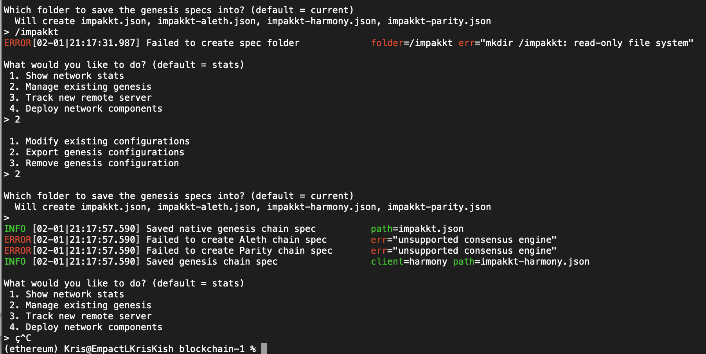

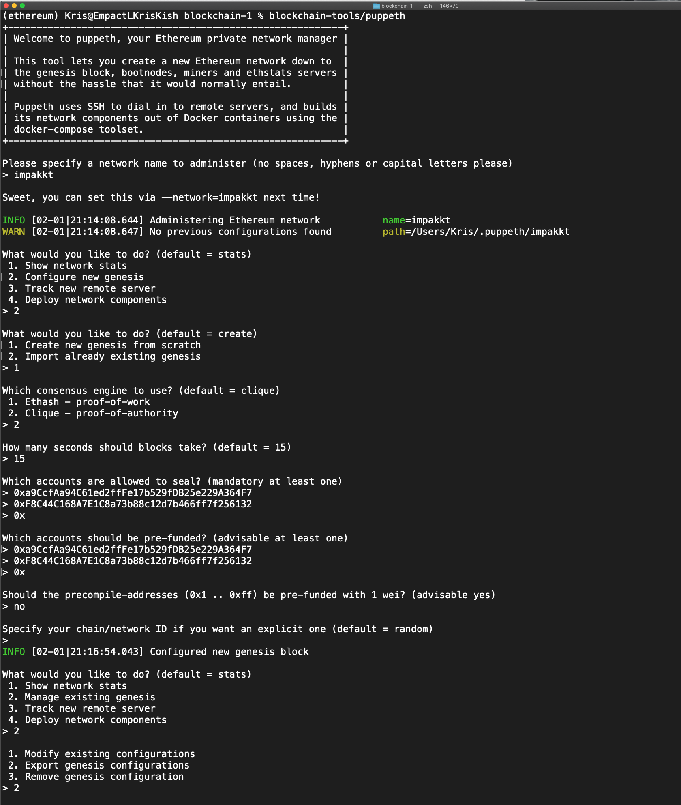

### 1. Open Terminal.

### 2. Run the following commands to initialize the nodes

        blockchain-tools/geth --datadir node1 init ./impakkt/impakkt.json

        blockchain-tools/geth --datadir node2 init ./impakkt/impakkt.json

### 3. Run the following commands in separate Terminals to start the impakkt blockchain

*Make sure you specify port 30304 for node2, as node1 will be using port 30303*

     blockchain-tools/geth --datadir node1 --unlock "a9CcfAa94C61ed2ffFe17b529fDB25e229A364F7" --mine --rpc --allow-insecure-unlock

    blockchain-tools/geth --datadir node2 --unlock "F8C44C168A7E1C8a73b88c12d7b466ff7f256132" --mine --port 30304 --bootnodes "enode://07d222c7f70139e47bf9a8010e1967e06075f440f95a5e56088c90211ed6c43bfd26aa013410219753a9f71d84a154e43ed4054ae1c399cd03de13873c8d1083@127.0.0.1:30303" --ipcdisable --allow-insecure-unlock

---

## **With both nodes up and running, the blockchain can be added to MyCrypto for testing.**

### 1. Open the MyCrypto app, then click Change Network at the bottom left:

### 2. Click "Add Custom Node" - You will need the custom network name and chain ID from above, and use ETH as the currency. *(Make sure that you scroll down to choose Custom in the "Network" column to reveal more options like Chain ID).*

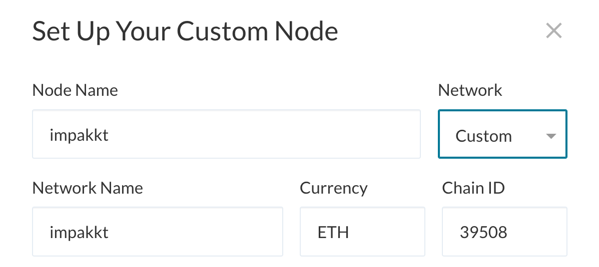

### 3. Type ETH in the Currency box.

### 4. In the Chain ID box, type the chain id you generated during genesis creation.

### 5. In the URL box type: http://127.0.0.1:8545. This points to the default RPC port on your local machine.

### 6. Finally, click Save & Use Custom Node.

### 7. In the left hand column, make sure to choose impakkt as the new network.

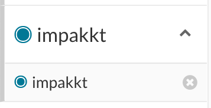

---

## **Send a test transaction**

### 1. Use the MyCrypto GUI wallet to connect to the node with the exposed RPC port. 

### 2. Import the keystore file from the node1/keystore directory into MyCrypto. This will import the private key. For the password, use the password  for node1 from above.

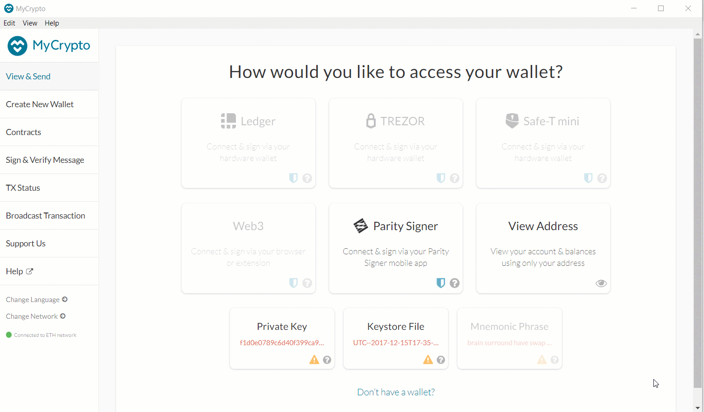

Pre-Funded Account
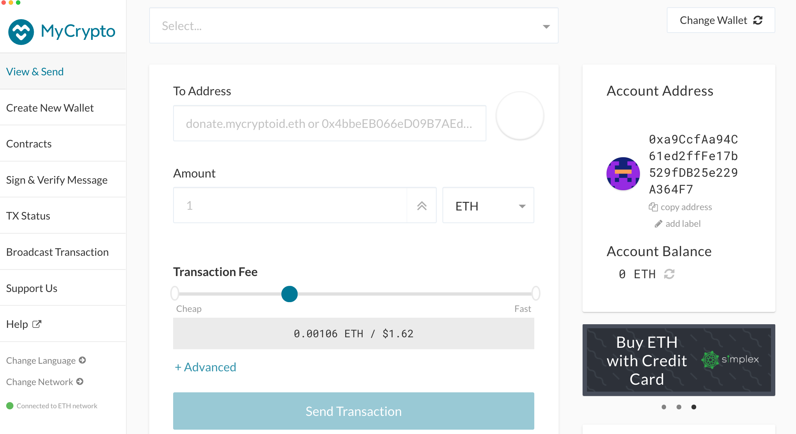

Funded Account
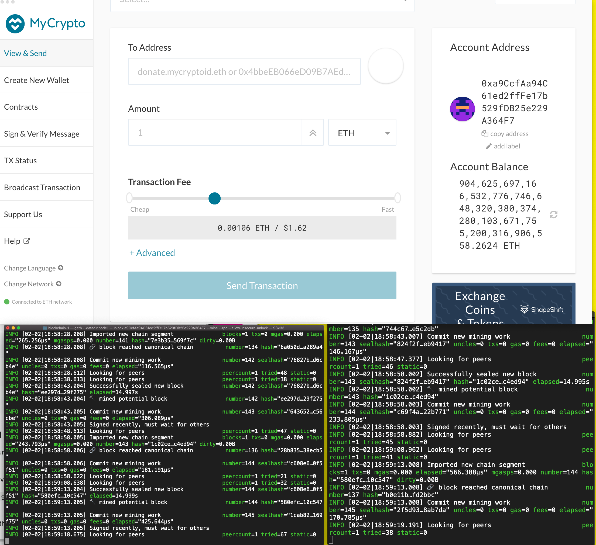

### 3. Send a transaction from the node1 account to the node2 account.

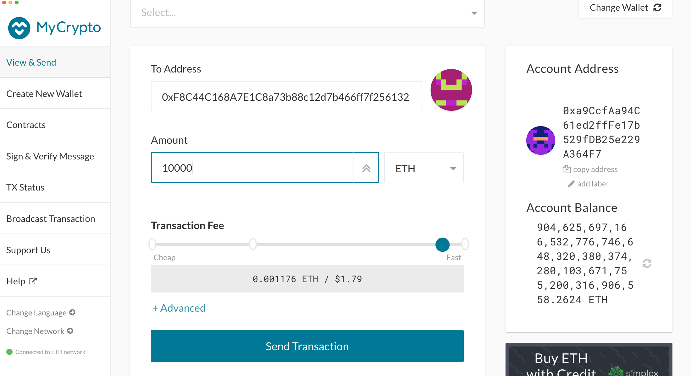

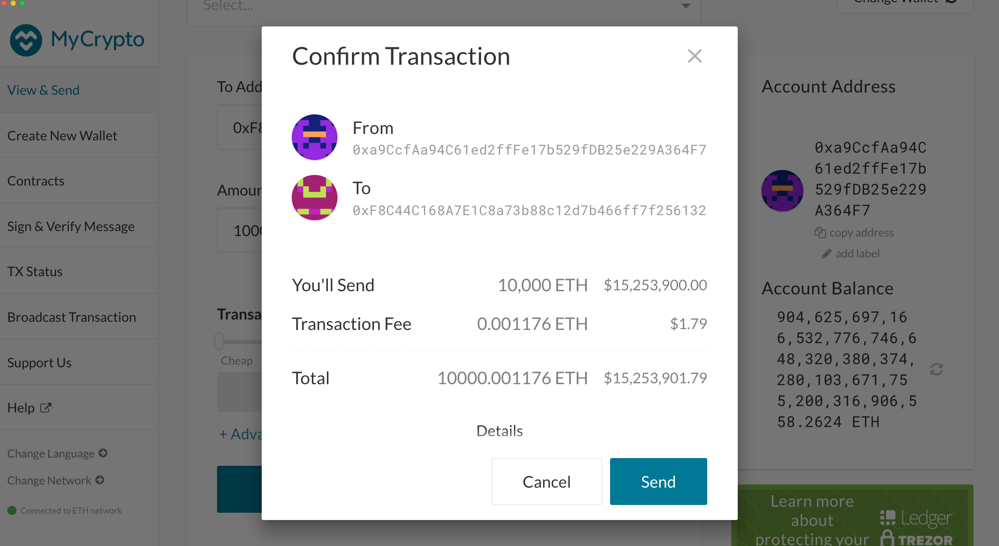

### 4. Copy the transaction hash and paste it into the "TX Status" section of the app, or click "TX Status" in the popup.

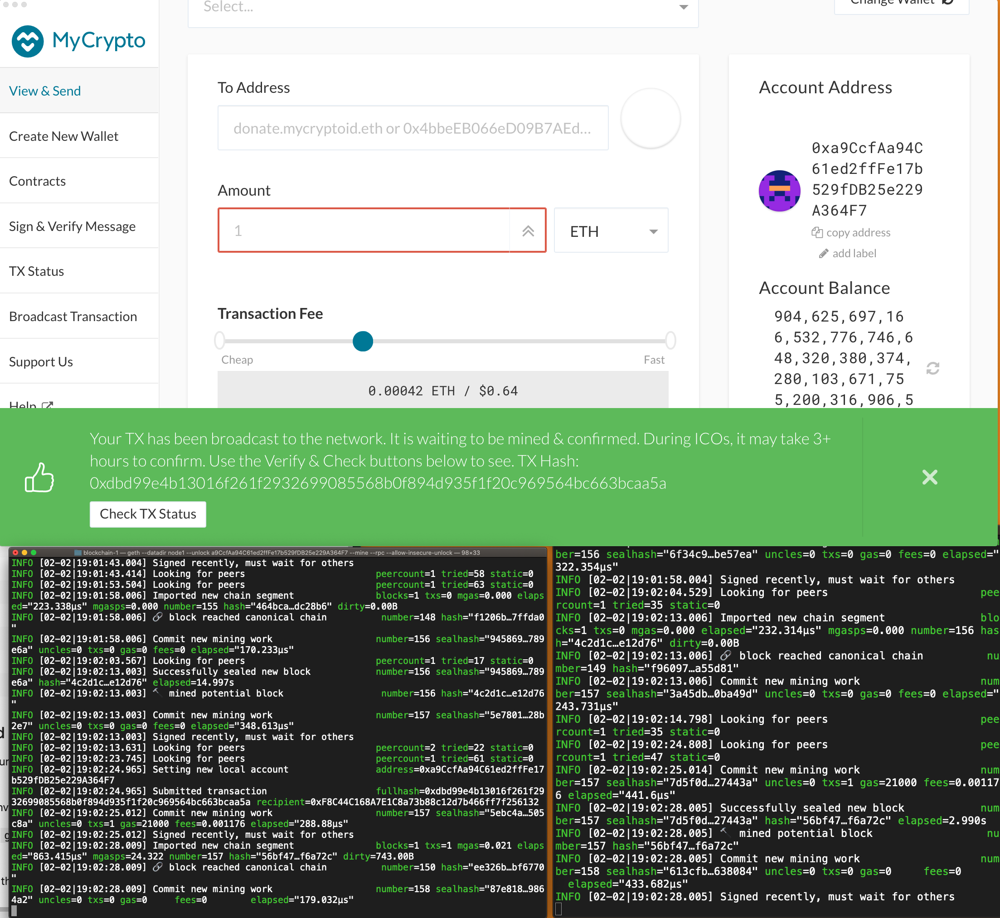

Transaction Status & Data
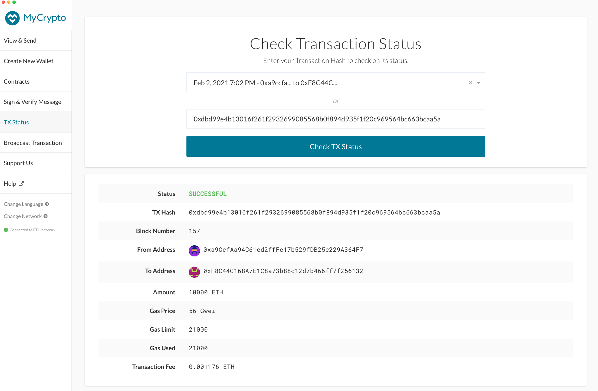

Post transaction funds in account
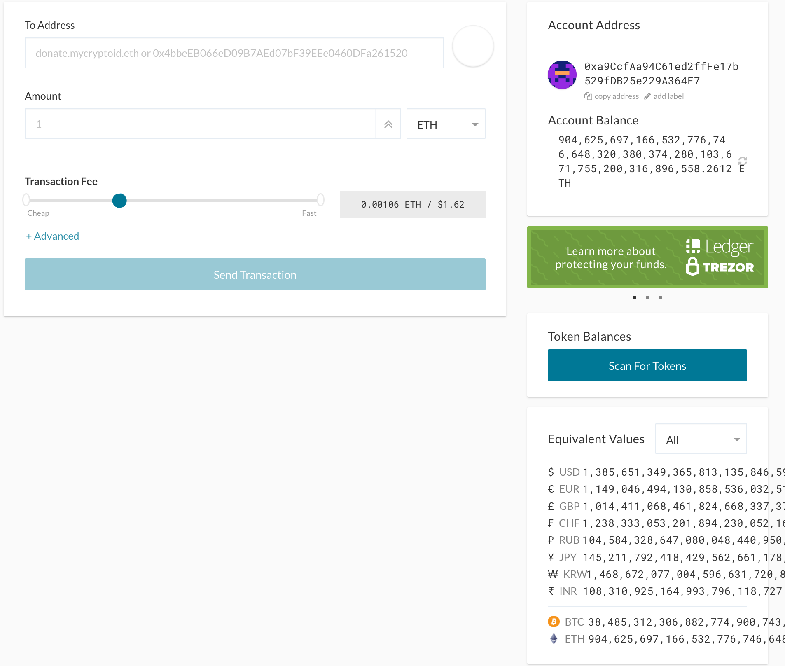

    
